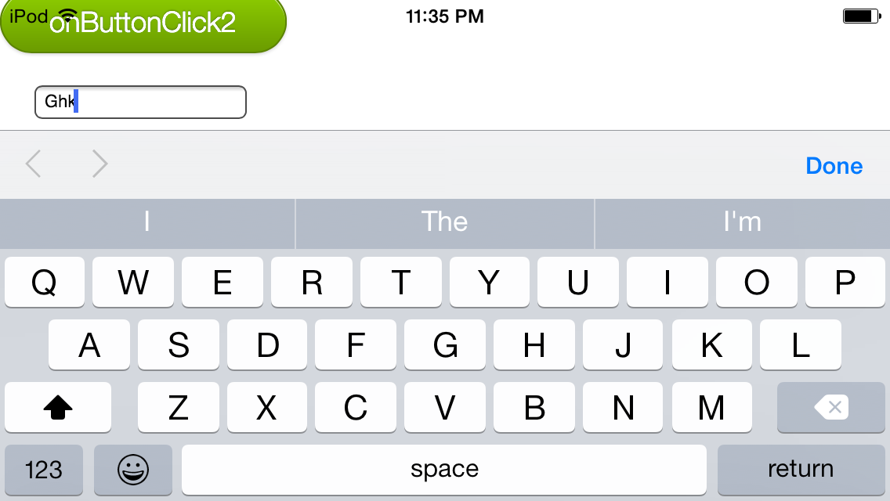

# mobileui-popup
A simple popup done with &lt;div> in landscape mode.
Also, checks the iOS landscape vs. keyboard, to make sure the both are in landscape. This is checked with an input field - just below the buttons (See: image at bottom).

This has three steps that needed to be accomplished with some help from Javascript.

1. add the ```popUp``` class
2. add the ```fadeout``` class with a delay
3. reset to the initial state with a slight delay

**NOTE** about an hour after I published this I realized I wanted to used _fixed_ and not *absolute*.


## CSS code for popup ##
```
    #popup {
        height:200px;
        width:300px;
        background-color:#eeeeee;
        padding:0.5em;
        border:1px black solid;
        border-radius: 0.5em;

        position:fixed;
        left:50px;
        top:50px;
    }
    .hidden {visibility:collapse;display:none;}
    .popUp {
        visibility:visible;display:block;
        opacity: 1;
        transition: opacity 1.5s linear;
    }
    .fadeOut {
        opacity: 0;
        transition: opacity 1.5s linear;
    }
```

## line by line break down ##

**box**

* height:200px;  - height of the box
* width:300px;   - width of the box
* background-color:#eeeeee; - the background color inside the box
* padding:0.5em; - space between the edge of the box and the text
* border:1px black solid; - the box border
* border-radius: 0.5em; - the round corner and border to the box

**placement**

* position:fixed; - places the box at a specified position relative to the screen's viewport and don't move it when scrolled. (See [Mozilla](https://developer.mozilla.org/en-US/docs/Web/CSS/position))
* left:50px; - 50 px from the left
* top:50px; - 50 px from the top

**display trick**<br>
Working with help from: http://fvsch.com/code/transition-fade/

**.hidden - set the block to initial be hidden**
* visibility:hidden; - *hidden* makes so the block is not seen, in this case collapse will work too.
* display:none; - *none* makes it so NO space is taken in the "flow"


**.popUp - set the block to be seen & set the initial state for animation**
* visibility:visible;display:block; -- toggles to make visible
* *below here NOT required, but here for completeness*
* opacity: 1; -- 1=fully visible, 0=hidden, anything between 0.0&lt;-&gt;1.0 is the tranparency percentage
* transition: opacity 1.5s ease-in-out; -- 

**.fadeOut - set the block to fadeOut (via CSS animation)**
* opacity: 0; - make fully transparent
* transition: opacity 1.5s ease-in-out; - animate the 'opacity' for '1.5' seconds and use the 'ease-in-out' transition formula

## iOS keyboard layout on iPodTouch ##


